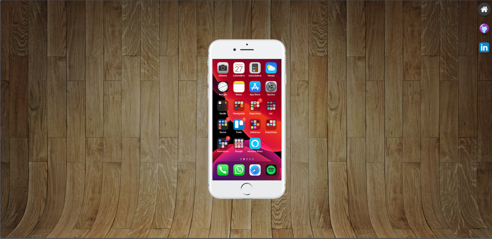
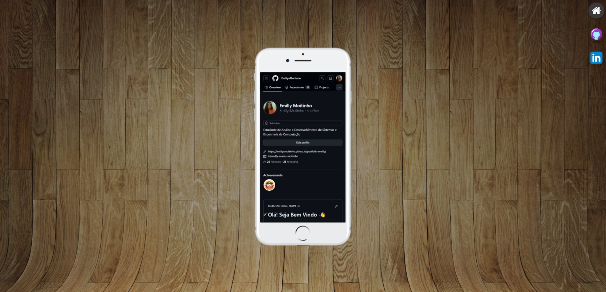
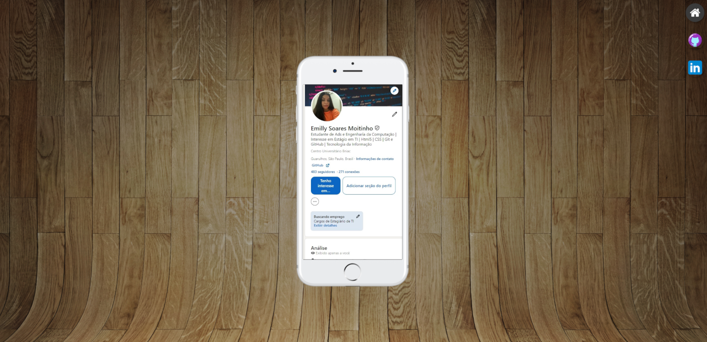

# Projeto Redes Sociais 📱

Este projeto foi desenvolvido como parte do **Módulo 4 de HTML e CSS do Curso em Vídeo, ministrado pelo Professor Guanabara.** 

O objetivo principal deste projeto é criar uma página web interativa onde ao clicar nos botões no canto superior direito, o conteúdo exibido na tela de um celular simulado é alterado. Para as páginas aparecerem na tela do celular, foi utilizado **iframe**. 

Este projeto foi desenvolvido para treinar os conhecimentos adquiridos de iframe e de outros tópicos abordados no curso. O projeto consiste em mostrar as redes sociais através da interface do celular simulado.

Link: https://emillysmoitinho.github.io/projeto-social/

## Funcionalidades
* A tela inicial do celular exibe os aplicativos e a interface como se fosse um iPhone.
* Ao clicar no ícone do GitHub, a tela do celular muda para mostrar o perfil do GitHub.
* Ao clicar no ícone do LinkedIn, a tela do celular muda para mostrar o perfil do LinkedIn.
* No final das páginas do GitHub e LinkedIn, há um botão escrito "Acesse" que leva até as páginas verdadeiras do GitHub e LinkedIn.

## Captura de Telas

### Tela Inicial:

### Tela do GitHub:

### Tela Linkedin:

## Estrutura de Arquivos
* index.html: Contém a estrutura HTML da página.
* style.css: Contém os estilos CSS para a página.
* home.html: Contém a estrutura HTML da página inicial
* github.html: Contém a estrutura HTML da página do GitHub.
* linkedin.html: Contém a estrutura HTML da página do LinkedIn.

## Tecnologias Utilizadas
* HTML5
* CSS3

## Créditos
Este projeto foi desenvolvido por Emilly Moitinho durante o curso de HTML e CSS do Curso em Vídeo, ministrado pelo Professor Guanabara.

